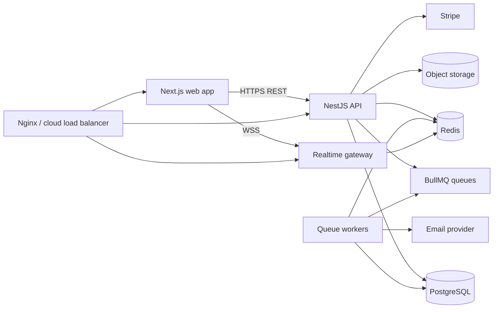
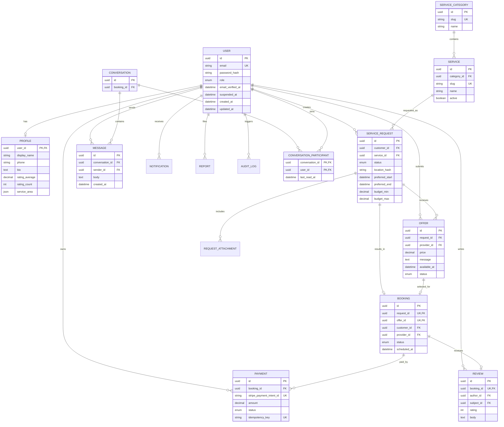
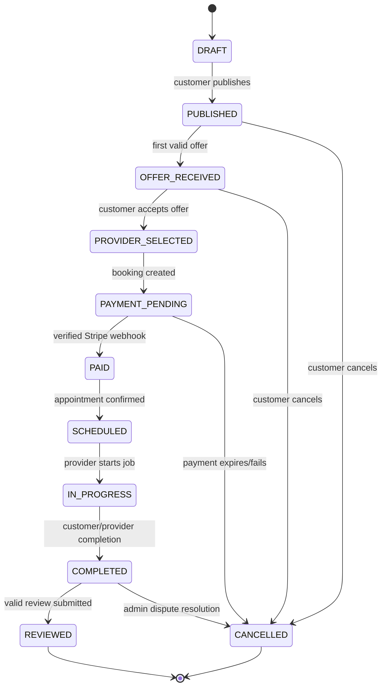

# Fixly Architecture

Fixly is a local-services marketplace connecting customers with service providers. The system is designed as a modular monorepo that can begin as a small deployment and scale to multiple API and worker instances without changing its business contracts.

## 1. System Architecture



### Runtime boundaries

- **Web** owns presentation, accessible forms, client-side caching, optimistic UI where safe, and route-level UX. It never decides whether an operation is authorized.
- **API** owns authentication, authorization, validation, state transitions, persistence, payment intent creation, upload authorization, and domain events.
- **Workers** own retryable or slow work such as notifications, email, cleanup, image processing, and payment reconciliation.
- **PostgreSQL** is the source of truth for users, marketplace data, bookings, payments, and audit records.
- **Redis** is used for rate limiting, short-lived cache entries, BullMQ, and Socket.IO adapter/pub-sub coordination. Redis data must be reconstructable unless explicitly documented otherwise.
- **Object storage** is accessed through a storage interface. Local disk is permitted only for development; production uses S3-compatible private buckets and signed URLs.

The initial deployment may run web, API, and workers as separate containers on one host. The API and workers remain stateless so they can later scale horizontally behind a load balancer.

## 2. Domain Model



### Data rules

- Use UUIDs, UTC timestamps, database foreign keys, and explicit enums for lifecycle statuses.
- Add compound indexes for request discovery (`service_id`, `status`, `created_at`), offers (`request_id`, `status`), bookings (`provider_id`, `status`, `scheduled_at`), messages (`conversation_id`, `created_at`), and moderation queues.
- Use soft suspension/deactivation for accounts and services. Do not use soft deletion for every table by default; use it where auditability or legal retention requires it.
- Monetary values are stored as integer minor units (for example, cents) with an ISO currency code. Never use floating-point values for money.
- Payment webhook event IDs are unique and persisted before processing to make webhook handling idempotent.

## 3. Request and Booking State Machine



State changes are performed by a backend domain service in a database transaction. The service checks the current state, actor permissions, ownership, and required data before updating. Direct status values from clients are ignored. Concurrent offer acceptance is protected with a transaction and conditional update so only one offer can win.

## 4. Repository Structure

```text
apps/
  web/                         Next.js App Router frontend
  api/                         NestJS REST API and WebSocket gateway
  worker/                      BullMQ workers and scheduled jobs
packages/
  database/                    Prisma schema, migrations, seed, client
  shared/                      DTO schemas, enums, API contracts
  config/                      Typed environment configuration
  eslint-config/               Shared lint rules
  tsconfig/                    Shared TypeScript bases
infra/
  docker/                      Development and production Docker assets
  nginx/                       Reverse proxy configuration
  terraform/                   Optional AWS-compatible infrastructure later
docs/
  adr/                         Architecture decision records
  diagrams/                    Extended diagrams
  runbooks/                    Operations and incident notes
 e2e/                          Playwright workflows
.github/workflows/             CI and deployment workflows
README.md
ARCHITECTURE.md
SECURITY.md
API.md
CONTRIBUTING.md
.env.example
pnpm-workspace.yaml
package.json
```

The repository will use pnpm workspaces and strict TypeScript. Package boundaries should be enforced by import rules: web cannot import API internals, and API modules cannot import worker implementation details.

## 5. API Architecture

The API is organized by feature rather than by technical artifact alone:

```text
apps/api/src/
  main.ts
  app.module.ts
  common/                    guards, filters, pipes, logging, request context
  modules/
    auth/                    registration, login, refresh, verification, reset
    users/                   profiles and account lifecycle
    services/                categories and service catalog
    requests/                request creation, discovery, attachments
    offers/                  provider offers and acceptance
    bookings/                lifecycle transitions and scheduling
    payments/                Stripe intents, webhooks, reconciliation
    conversations/           chat, read receipts, presence
    notifications/           in-app notification queries
    reviews/                 reviews and moderation
    admin/                   statistics, users, reports, audit logs
    health/                  dependency health checks
```

Each feature may contain controller, DTO, service, repository/query code, policy/authorization code, and tests. Controllers translate HTTP to application calls; domain services enforce business rules; repositories isolate Prisma queries. Use Swagger decorators on public DTOs and controllers. Use a global validation pipe with transformation disabled unless explicitly safe for a DTO.

Representative API groups:

- `/auth`: register, login, refresh, logout, email verification, password reset.
- `/services`: public catalog and service detail.
- `/requests`: customer CRUD, provider discovery, attachments, and request status.
- `/requests/:id/offers`: provider offer creation and customer offer listing.
- `/offers/:id/accept`: transactional offer acceptance.
- `/bookings`: booking details, lifecycle actions, and schedule.
- `/payments`: payment intent creation and Stripe webhook receiver.
- `/conversations`: participant-scoped conversations, messages, read receipts.
- `/reviews`: booking-scoped review creation and moderation.
- `/admin`: role-protected statistics, users, reports, payments, and audit logs.
- `/health`: liveness and dependency readiness checks.

Use consistent error responses with a request ID, machine-readable code, human-readable message, and optional field errors. Pagination uses cursor pagination for feeds/messages and bounded page/limit pagination for administrative tables.

## 6. Authentication and Authorization

- Passwords are hashed with Argon2id and are never returned by API responses.
- Use short-lived access tokens in secure, HttpOnly cookies or a server-side session strategy; use rotating refresh tokens with server-side revocation records. Do not store long-lived tokens in localStorage.
- Registration requires email verification before provider/customer actions that create marketplace risk. Password reset tokens are single-use, hashed at rest, short-lived, and invalidated after use.
- CSRF protection is required when cookie authentication is used. Configure same-site cookies, origin checks, and a CSRF token for state-changing browser requests.
- Use NestJS guards for authentication and role checks, plus resource policies for ownership and participant checks. A role guard alone is insufficient for object-level authorization.
- Admin actions require explicit `ADMIN` authorization and produce audit log entries. Suspension is checked on every authenticated request.
- Rate-limit login, registration, password reset, message creation, upload initialization, and payment endpoints. Use Redis-backed limits in production.

Frontend route guards improve UX only. The API remains authoritative for every operation.

## 7. Development Roadmap and Phase Gates

### Phase 1: Foundation
Create the pnpm monorepo, Next.js web app, NestJS API, worker skeleton, strict TypeScript, lint/formatting, Docker Compose for PostgreSQL and Redis, Prisma schema/migrations/seed, configuration validation, and health endpoint.

**Gate:** `docker compose up`, database migration/seed, API health check, web shell, lint, typecheck, and baseline tests all pass.

### Phase 2: Identity
Implement users, profiles, registration/login/logout/refresh, password hashing, verification/reset architecture, RBAC, and account suspension.

**Gate:** authenticated customer/provider/admin flows and unauthorized-access tests pass.

### Phase 3: Marketplace core
Implement service catalog, request creation and discovery, attachments metadata, offers, transactional acceptance, booking state machine, indexes, and audit events.

**Gate:** invalid transitions and concurrent acceptance are rejected by integration tests.

### Phase 4: Product UX
Build responsive dashboards, forms with React Hook Form/Zod, TanStack Query data access, loading/error/empty states, and accessible confirmations/toasts.

**Gate:** a customer can publish a request and inspect offers; a provider can submit an offer through the real API.

### Phase 5: Realtime
Add conversations, participant authorization, WebSocket messages, typing, presence, read receipts, notifications, and Redis adapter/pub-sub.

**Gate:** two API instances can exchange a conversation event through Redis.

### Phase 6: Jobs and notifications
Add BullMQ workers, retry/backoff policies, email abstraction, notification delivery, cleanup, and image-processing job boundaries.

**Gate:** failed jobs retry safely and duplicate events do not duplicate user-visible effects.

### Phase 7: Payments
Add Stripe test-mode payment intents, webhook verification, payment transitions, idempotency records, failure handling, and reconciliation jobs.

**Gate:** only verified backend/webhook events can mark a booking paid; replayed webhooks are harmless.

### Phase 8: Storage and uploads
Add local/S3-compatible storage adapters, MIME and size validation, private object keys, signed access URLs, authorization checks, and malware-scanning integration boundary.

**Gate:** users cannot read another user's attachment and invalid files never reach permanent storage.

### Phase 9: Testing
Add unit tests for policies/state transitions, integration tests with PostgreSQL/Redis, API tests, and Playwright E2E for the complete marketplace flow plus abuse cases.

**Gate:** CI runs deterministic checks from a clean environment.

### Phase 10: Security hardening
Finalize headers, CORS, CSRF, rate limits, validation, logging redaction, dependency scanning, upload defenses, secret handling, and `SECURITY.md`.

**Gate:** security checklist and negative authorization tests are complete.

### Phase 11: Observability
Add structured logs, request IDs, domain events, health/readiness checks, metrics-ready instrumentation, and operational runbooks.

**Gate:** an operator can trace a request through API, database, queue, and webhook logs without secrets being exposed.

### Phase 12: Production delivery
Add multi-stage images, production Compose/local parity, Nginx or load-balancer configuration, GitHub Actions PR checks, image build/publish, migration process, and AWS-compatible deployment documentation.

**Gate:** production images build reproducibly and deployment/rollback steps are documented.

### Phase 13: AI assistant
Only after core flows are stable, add a provider-agnostic request-analysis service returning validated structured output such as category, priority, suggested service, and duration. AI output is advisory only and cannot authorize users, alter payment state, or bypass validation.

**Gate:** provider failures degrade gracefully, outputs are schema-validated, and prompt/input data handling is documented.

## 8. Major Technical Decisions

### Next.js and NestJS in one monorepo
This keeps the frontend and backend independently deployable while sharing contracts and enums. A single repository improves local setup and CI consistency without coupling runtime deployments.

### PostgreSQL as source of truth
Marketplace transactions, authorization relationships, and payment state require relational constraints and transactions. Redis is deliberately not used as a second database.

### Prisma
Prisma provides typed queries, migrations, and a clear schema for a portfolio project. Complex reporting queries may use reviewed SQL through a repository rather than forcing every query through the generated client.

### Stripe webhooks over client confirmation
The browser can initiate checkout, but only a verified webhook or backend reconciliation can mark money as received. This prevents forged client payment status.

### REST plus WebSockets
REST is easier to document, cache, test, and integrate for resource operations. WebSockets are limited to latency-sensitive chat, presence, read receipts, and notifications.

### BullMQ and Redis
Queues isolate slow/retryable work from request latency and provide a realistic worker model. Redis also supports rate limits and multi-instance realtime coordination, so it has concrete responsibilities rather than being ornamental.

### Modular monolith before microservices
Feature modules and package boundaries provide separation without distributed-transaction and deployment overhead. Services can be extracted later only when operational or scaling evidence justifies it.

### Cursor pagination for activity streams
Messages and request feeds grow continuously, so cursor pagination avoids deep-offset performance problems. Administrative tables can use bounded offset pagination initially because filtering and direct page navigation are useful there.

## 9. Required Documentation Produced During Implementation

- `README.md`: setup, features, commands, environment, deployment, and portfolio overview.
- `SECURITY.md`: threat model, controls, secrets, reporting, and operational practices.
- `API.md`: endpoint conventions, authentication, pagination, errors, and webhook behavior.
- `CONTRIBUTING.md`: local setup, branching, tests, migrations, and review expectations.
- `docs/adr/`: decisions that materially change persistence, auth, storage, payments, or deployment.

## 10. First Implementation Slice

The first coding slice should implement only Phase 1: workspace configuration, `apps/web`, `apps/api`, `apps/worker`, shared config, Prisma's initial schema/migration/seed, Docker Compose for PostgreSQL and Redis, and a tested `/health` endpoint. It should not introduce placeholder marketplace endpoints or fake payment/chat behavior.
